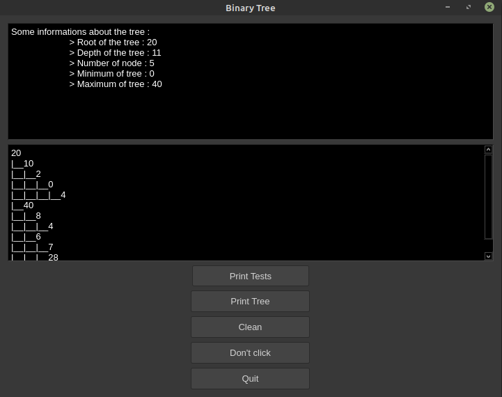

# HuffmanCoding
Implementation of Huffman coding in cpp.

[](http://forthebadge.com)  [](http://forthebadge.com)

> "In computer science and information theory, a Huffman code is a particular type of optimal prefix code that is commonly used for lossless data compression." [wikipedia](https://en.wikipedia.org/wiki/Huffman_coding)

***

# Table of contents
- [Directory hierarchy](#Directory-hierarchy)  
- [Needed](#Needed)  
- [Installation](#Installation)  
- [Launch](#Launch)  
- [Usage](#Usage)
- [Details of functions](Details-of-functions)  
    - [Tree.cpp](#Tree)
    - [Writer.cpp](#Writer)
    - [Test.cpp](#Test)
    - [WindowQT.cpp](#WindowQT)
- [Status](#Status)
- [Explanation of the project](#Explanation-of-the-project)
- [Some idea for amelioration](#Some-idea-for-amelioration)
- [Authors](#Authors)  


# Directory hierarchy

The project is split in many sub directories like the hierarchy as below : 
```bash
.
├── build.sh
├── Makefile
├── README.md
└── src
    ├── lib
    │   ├── Parser.cpp
    │   ├── Parser.hpp
    │   ├── Tree.cpp
    │   ├── Tree.hpp
    │   ├── Writer.cpp
    │   └── Writer.hpp
    ├── main
    │   └── Main.cpp
    ├── _test
    │   ├── Test.cpp
    │   └── Test.hpp
    └── windowQT
        ├── CMakeLists.txt
        ├── WindowQT.cpp
        └── WindowQT.hpp

5 directories, 15 files
```
* src : Contains all sources codes.
* src/lib : Contains all librairies using by the projet.
* src/main : Contains the main file.
* src/test : Contains the tests files.
* src/windowQT : Contains application files.  

# Needed


Our program is made in C++ and use Qt for the graphic interface. Also, for our program to work, we need two or three little things :

- [cmake](https://cmake.org/install/) version superior to 3.0.0 is required.
- [Qt libraries](https://doc.ubuntu-fr.org/qt) version superior to 5.0 is required.
- A C++ compiler like [g++](https://doc.ubuntu-fr.org/gcc) (recommanded) or [Clang](https://clang.llvm.org/get_started.html).


# Installation

To build our program, just needed to write this in a terminal :

- ``` make ```


# Launch

To start our program, two options are given :

- ``` make run ``` to have a display in the terminal.
- ``` make window ``` to run a graphic interface where you can interact with our program.

# Usage
  
Here a first look of the interface for the project. All buttons were to clickable.  
 This button print all tests in the interface.  
  This button print the tree in the interface.  
  This button clean all the window.  
  This button close the window.  
All buttons are connect to functions that have description in windowQT file (see below).  

# Details of functions

## Tree
```cpp

/**
 * Function : Constructor by copy.
 * Return : 'Sommet'.
 * Description : Create an object 'Sommet' with default parameters.
 * */
Sommet::Sommet() : data(0), left(nullptr), right(nullptr) {}

/**
 * Function : Constructor by copy.
 * Return : 'ArbreB'.
 * Description : Create an object 'ArbreB' with default parameters.
 * */
ArbreB::ArbreB() : root(nullptr)  {}

/**
 * Function : Copy.
 * Return : 'Sommet'*.
 * Description : Return a deep copy of this.
 * */
Sommet* Sommet::copy() {}

/**
 * Function : Constructor by copy.
 * Return : 'Sommet'.
 * Parameter : other, the other tree for the copy.
 * Description : Create an object 'Sommet' with an other.
 * */
Sommet::Sommet(const Sommet& other) {}

/** Function : Constructor by copy.
 * Return : 'ArbreB'.
 * Parameter : other, the other tree for the copy.
 * Description : Create a object 'ArbreB' with an other.
 * */
ArbreB::ArbreB(const ArbreB& other) {}

/** Function : Constructor with parameter.
 * Return : 'Sommet'.
 * Paramter : newData, the data to init the node.
 * Description : Create a object 'Sommet' by initializing the data.
 * */
Sommet::Sommet(int newData) : data(newData), left(nullptr), right(nullptr) {}

/** Function : Constructor with parameter.
 * Return : 'ArbreB'.
 * Parameter : rootData, tha data to init the root of the tree.
 * Description : Create a object 'ArbreB' by initializing the root.
 * */
ArbreB::ArbreB(int rootData) {}

/** Function : Overloading operator=.
 * Return : 'Sommet'.
 * Parameter : other, the node for the copy.
 * Description : Copy a object 'Sommet' with an other.
 * */
Sommet& Sommet::operator=(Sommet other) {}

/** Function : Overloading operator=.
 * Return : 'ArbreB'.
 * Parameter : newData, the data for swap.
 * Description : Swap the value of the 'Sommet' with newData.
 * */
Sommet& Sommet::operator=(int newData) {}

/** Function : Overloading operator=.
 * Return : 'ArbreB'.
 * Parameter : other, the other tree for the copy.
 * Description : Copy a object 'ArbreB' with an other.
 * */
ArbreB& ArbreB::operator=(const ArbreB& other) {}

/** Function : Overloading operator==.
 * Return : Boolean.
 * Parameter : other, the other node for compare.
 * Description : Say if the 'Sommet' is equal to an other.
 * */
bool Sommet::operator==(const Sommet& other) {}

/** Function : Overloading operator==.
 * Return : Boolean.
 * Parameter : node, the other node for compare.
 * Description : Say if the 'Sommet' is equal to an other, recursive version.
 * */
bool Sommet::equal(Sommet *node) {}

/** Function : Overloading operator==.
 * Return : Boolean.
 * Parameter : other, the other tree for compare.
 * Description : Say if the 'ArbreB' is equal to an other.
 * */
bool ArbreB::operator==(const ArbreB& other) {}

/** Function : Overloading operator<<.
 * Return : 'ArbreB'.
 * Parameter : newData, the value to add in the tree.
 * Description : Add a node with the value newData in the tree.
 * */
ArbreB& ArbreB::operator<<(int newData) {}

/** Function : add.
 * Return : 'ArbreB'.
 * Parameter : node, for recursive call,
 *              newData, the value ot add.
 * Description : Add a node with the value 'newData' in the tree, recursive version.
 * */
void ArbreB::add(Sommet *root, int newData) {}

/** Function : Overloading operator>>.
 * Return : 'ArbreB'.
 * Parameter : dellData, data need to be deleted.
 * Description : Dell a node with the value 'dellData' in the tree, if
 * the node with 'dellData' existe.
 * */
ArbreB& ArbreB::operator>>(int dellData) {}

/** Function : dell.
 * Return : 'ArbreB'.
 * Parameters : root, node used for recursif,
 *              dellData, data need to be deleted.
 * Description : Delete a node with the value 'dellData' in the tree, if
 * the node with 'dellData' existe, recursive version.
 * */
void ArbreB::dell(Sommet *root, int dellData) {}


/** Function : Overloading operator<<.
 * Return : std::ostream.
 * Parameter : flux, where we write, node we print.
 * Description : Print the node recursively.
 * */
std::ostream &operator<<(std::ostream &flux, const Sommet& node) {}

/** Function : Overloading operator<<.
 * Return : std::ostream.
 * Parameter : flux, where we write, tree we print.
 * Description : Print the tree.
 * */
std::ostream &operator<<(std::ostream &flux, const ArbreB& tree) {}

/** Function : Overloading operator+=.
 * Return : 'ArbreB'.
 * Parameter : other, for merge two trees.
 * Description : Merge two trees.
 * */
ArbreB& ArbreB::operator+=(const ArbreB& other) {}

/** Function : Overloading operator-=.
 * Return : 'ArbreB'.
 * Parameter : other, for split two trees.
 * Description : Split two trees.
 * */
ArbreB& ArbreB::operator-=(ArbreB& other) {}

/** Function : Overloading operator[].
 * Return : 'Sommet*'.
 * Parameter : index, the position of the node in the tree we need to get.
 * Description : Get a precise node in the tree.
 * */
Sommet* ArbreB::operator[](int index) {}

/** Function : find.
 * Return : 'Sommet*'.
 * Parameter : root, for recursiv call, 
 *             dataSearch, the value we want to find.
 * Description : Split two trees.
 * */
Sommet* ArbreB::find(Sommet* root, int dataSearch) {}

/* Getters */
int Sommet::getData() const {}

Sommet* Sommet::getLeft() const {}

Sommet* Sommet::getRight() const {}

Sommet* ArbreB::getRoot() const {}

Sommet* ArbreB::getRandLeaf(Sommet* root) const{}
/* End getters */

/* Setters */
void Sommet::setLeft(int leftData) {}

void Sommet::setRight(int rightData) {}
/* End setters */

/* Methodes */
/** Function : Min.
 * Parameter : min, the minimum of the tree.
 * Description : Found the minimum value in the tree, recursive version.
 * */
void Sommet::Min(int *min) {}

/** Function : dataMin
 * Return : int.
 * Description : Found the minimum value in the tree.
 * */
int Sommet::dataMin() {}

/** Function : Max.
 * Parameter : max, the maximum of the tree.
 * Description : Found the maximum value in the tree, recursive version.
 * */
void Sommet::Max(int *max) {}

/** Function : dataMax
 * Return : int.
 * Description : Found the maximum value in the tree.
 * */
int Sommet::dataMax() {}

/** Function : isLeaf
 * Return : Boolean.
 * Description : Say if the node is a leaf.
 * */
bool Sommet::isLeaf() {}

/** Function : printBeautifulTree
 * Description : Print tree like the next pattern.
 *                  right right child ...
 *      right child
 *                  right left child ...
 * root
 *                  left right child ...
 *      left child
 *                 left left child ...
 * */
void Sommet::printBeautifulTree(int space) {}

int maximum(int a, int b){}

/** Function : countDepht.
 * Return : int.
 * Description : Count the depth of the tree.
 * */
int Sommet::countDepth() {}

/** Function : countSize.
 * Return : int.
 * Description : Count the size of the tree.
 * */
int Sommet::countSize() {}
/* End printers */

/* Destructors */
Sommet::~Sommet() {}
/* End destructors */
```

## Writer
```cpp
/**
 * Function : Default constructor.
 * Return : Writer.
 * Description : Default constructor.
 * */
Writer::Writer() : file("\0") {}

/**
 * Function : Constructor with parameter.
 * Return : Writer.
 * Parameter : nameFile : the name of the file.
 * Description : Constructor with parameter.
 * */
Writer::Writer(std::string nameFile) : file(nameFile) {}

/**
 * Function : writeBeautifulTreeInFile.
 * Parameter : Tree, the tree need to write in a file.
 * Description : Write a tree in a file.
 * */
void Writer::writeBeautifulTreeInFile(ArbreB tree) {}

/**
 * Function : writeBeautifulTreeInFileRec.
 * Parameter : node, the node need to write in a file, recursive version.
 *                 flux, where we write.
 * Description : Write a tree in a file.
 * */
void Writer::writeBeautifulTreeInFileRec(Sommet* node, int space, std::ofstream& flux) {}

/**
 * Function : writeResultAllTests.
 * Description : Write result of tests.
 * */
void Writer::writeResultAllTests() {}
 
```
## Test
```cpp
/**
 * Function : Constructor by default.
 * Return : 'Test'.
 * Description : Create an object 'Test' with default parameters.
 * */
Test::Test() : sumTest(0), numTestGlobal(0), inColor(true) {}

/**
 * Function : Constructor with parameters.
 * Return : 'Test'.
 * Argument : withColor, boolean say if we want print tests in color or not.
 * Description : Create an object 'Test' with default parameters and color.
 * */
Test::Test(bool withColor) : sumTest(0), numTestGlobal(0), inColor(withColor) {}

/**
 * Function : inRed.
 * Arguments : std::string msg.
 * Return : std::string.
 * Description : Colorized the string 'msg' in red.
 * */
std::string inRed(std::string msg) {}

/**
 * Function : inGreen.
 * Arguments : std::string msg.
 * Return : std::string.
 * Description : Colorized the string 'msg' in green.
 * */
std::string inGreen(std::string msg) {} 

/* Global variables */
std::string OK = " " + inGreen("OK") + " ";
std::string FAIL = inRed("FAIL");

/**
 * Function : allTest.
 * Description : Print all results of test in our terminal.
 * */
void Test::allTest() {}

/**
 * Function : testDefaultConstructorNode.
 * Return : std::string.
 * Description : Test if constructor by defautl is a success. Return 'OK' if yes, 'FAIL' if no.
 * */
std::string Test::testDefaultConstructorNode() {}

/**
 * Function : testCopyConstructorNode.
 * Return : std::string.
 * Description : Check if constructor by copy is a success.
 * */
std::string Test::testCopyConstructorNode() {}

/**
 * Function : testParamConstructorNode.
 * Return : std::string.
 * Description : Check if constructor by default without child is a success.
 * */
std::string Test::testParamConstructorNode() {}

/**
 * Function : testAssignNode.
 * Return : std::string.
 * Description : Check if operator= is a success.
 * */
std::string Test::testAssignNode() {}

/**
 * Function : testEqualsNode.
 * Return : std::string.
 * Description : Check if two node are equals is a success.
 * */
std::string Test::testEqualsNode() {}

/**
 * Function : testDepth.
 * Return : 'std::string'.
 * Description : Check the depth of the tree. If the tree has no child, depth = 1. If he has child, depth  = 2. If child has child, depth = 3.....
 * */
std::string Test::testDepth() {}

/**
 * Function : testSize.
 * Return : std::string.
 * Description : Check the size of tree. One node => size = 1, two nodes => size = 2...
 * */
std::string Test::testSize() {}

// ArbreB
/**
 * Function : testCopyConstructorNode.
 * Return : std::string.
 * Description : Check if constructor by default is a success.
 * */
std::string Test::testDefaultConstructorTree() {}

/**
 * Function : testParamConstructorTree.
 * Return : std::string.
 * Description : Check the constructor with parameter of a tree.
 * */
std::string Test::testParamConstructorTree() {}

/**
 * Function : testAssignTree
 * Return : std::string.
 * Description : Check if the copy of a tree in another is a success.
 * */
std::string Test::testAssignTree() {}

/**
 * Function : testEqualsTree.
 * Return : std::string.
 * Description : Check if two are equals (same nodes, sames size, same depth).
 * */
std::string Test::TestEqualsTree() {}

/**
 * Function : testAdd.
 * Return : std::string.
 * Description : Check if we can add a node in a tree.
 * */
std::string Test::testAdd() {}

/**
 * Function : testDell.
 * Return : std::string.
 * Description : Check if deletion on a node is a success.
 * */
std::string Test::testDell() {}

/**
 * Function : testFind.
 * Return : std::string.
 * Description : Check if we can find a specific node by his value in the tree.
 * */
std::string Test::testFind() {}

/**
 * Function : testGetNodeAtIndex.
 * Return : std::string.
 * Description : Check if we can find a specific node by his position in the tree.
 * */
std::string Test::testGetNodeAtIndex() {}

/**
 * Function : testJoin.
 * Return : 'std::string'.
 * Description : Check if we can make a fusion with two trees.
 * */
std::string Test::testJoin() {}

/**
 * Function : testGetNodeAtIndex.
 * Return : std::string.
 * Description : Check if we can make a split of a tree. We should have two trees at the end.
 * */
std::string Test::testSplit() {}

/* Getters */
int Test::getSumTest() const {
    return sumTest;
}

int Test::getNumTestGlobal() const {
    return numTestGlobal;
}
/* End getters */
```
## WindowQT
```cpp

/** Function : Window().
* Description : Default constructor for window. It put layout, button, and text area inside the window.
 * */
Window(){}

/** Function : ~Window().
* Description : Destructor for Window.
* */
~Window(){

/** Function : printTree().
* Description : Print the tree and his informations in the window.
* */
void printTree(){}
            
/** Function : delArbre().
* Description : Clean all the window.
* */
void delArbre(){}

/** Function : secretButton().
 * Description : Configure the secret button.
 * */
void secretbutton(){}

/** Function : printTest().
 * Description : Print all test in the window.
 * */
void printTest(){}

/** Function : resizeFull().
 * Description : Resize the window with the size of current display.
 * */
void resizeFull(){}

```
# Status

20/11/2020 : version 3.0 => End part1

# Explanation of the project

- Part1 : Implementation of a tree.  
For the first part we were to implement a tree and a graphic interface.
The word has been split in two. Mickael had to implement the tree and Quentin had to implement the interface.
For the tree


# Some idea for amelioration

Here some idea for future version :
- Our interface can interact with the painting tree, like adding node, deleting node, spliting tree, fusion of two differents tree...
- Dell root in the millde of the tree isn't working. We have to fix it.
- Solve memory leaks in the graphic interface.

# Authors
* **LE DENMAT Mickael 21804355**
* **GRUCHET Quentin 21605636**

***


