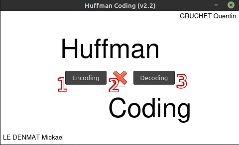

# HuffmanCoding
Implementation of Huffman coding in cpp.

[](http://forthebadge.com)  [](http://forthebadge.com) [](https://forthebadge.com) [](https://forthebadge.com)

> "In computer science and information theory, a Huffman code is a particular type of optimal prefix code that is commonly used for lossless data compression." [wikipedia](https://en.wikipedia.org/wiki/Huffman_coding)

***

# Table of contents
- [Directory hierarchy](#Directory-hierarchy)  
- [Needed](#Needed)  
- [Build](#Build)  
- [Launch](#Launch)  
- [Usage](#Usage)
- [Details of functions](Details-of-functions)  
    - [Tree.cpp](#Tree)
    - [Writer.cpp](#Writer)
    - [Test.cpp](#Test)
    - [Parser.cpp](#Parser)
    - [Mainwindow.cpp](#MainWindow)
    - [Mybutton.cpp](#MyButton)
    - [MyTextEdit.cpp](#MyTextEdit)
    - [Tiltewidget.cpp](#Titlewidget)
    - [Treewidget.cpp](#Treewidget)

- [Status](#Status)
- [Explanation of the project](#Explanation-of-the-project)
- [Some ideas for amelioration](#Some-ideas-for-amelioration)
- [Authors](#Authors)  


# Directory hierarchy

We split the project in many sub directories like the hierarchy as below : 
```bash
.
├── build.sh
├── Makefile
├── README.md
├── screenshots
│   ├── encodingMenu.png
│   ├── mainMenu.png
│   └── treeMenu.png
└── src
    ├── lib
    │   ├── Parser.cpp
    │   ├── Parser.hpp
    │   ├── Tree.cpp
    │   ├── Tree.hpp
    │   ├── Writer.cpp
    │   └── Writer.hpp
    ├── main
    │   └── Main.cpp
    ├── _test
    │   ├── Test.cpp
    │   └── Test.hpp
    ├── txtQT
    │   ├── binary.txt
    │   └── resultTest.txt
    └── windowQt
        ├── CMakeLists.txt
        ├── CMakeLists.txt.user
        ├── icons
        │   ├── clear.png
        │   ├── encoding.jpg
        │   ├── exit.png
        │   ├── home.png
        │   └── tree.png
        ├── main.cpp
        ├── Mainwindow.cpp
        ├── Mainwindow.hpp
        ├── Mybutton.cpp
        ├── Mybutton.hpp
        ├── Mytextedit.cpp
        ├── Mytextedit.hpp
        ├── Tiltewidget.cpp
        ├── Tiltewidget.hpp
        ├── Treewidget.cpp
        └── Treewidget.hpp

8 directories, 35 files

```
* src : Contains all sources codes.
* src/lib : Contains all librairies using by the projet.
* src/main : Contains the main file (without interface).
* src/test : Contains the tests files.
* src/windowQt : Contains application files.  
* src/windowQt/icons : Contains images use for applications.  

# Needed


Our program is made in C++ and use Qt for the graphic interface. Also, for our program to work, we need two or three little things :

- [cmake](https://cmake.org/install/) version superior to 3.0.0 is required.
- [Qt libraries](https://doc.ubuntu-fr.org/qt) version superior to 5.0 is required.
- A C++ compiler like [g++](https://doc.ubuntu-fr.org/gcc) (recommanded) or [Clang](https://clang.llvm.org/get_started.html).


# Build

To build our program, you just needed to write this in a terminal :

- ``` make ```


# Launch

To start our program, you have two options :

- ``` make run ``` to have a display in the terminal.
- ``` make window ``` to run a graphic interface where you can interact with our program.

# Usage


This is our main menu of our application. All buttons are fonctional.
1. This button open the encoding menu.
2. This button stop our application.
3. This button open the decoding menu. It's not implemented yet but don't worry it will come very soon.
  
 

This is our encoding menu. Here you will can encoding any text and see in live the result.
1. This button allows you to return to the previous menu.
2. This button clear the display.
3. This button close the application 
4. This button allows you to draw three of your entering text.
5. This button translate your text with Hauffman Coding.
6. This is where you will write the text you want to translate.
7. This is where you have the result of your translation.


1. This is a simple display of the tree.
2. This button allows you to return to the previous menu.

# Details of functions

## Tree
```cpp

/**
 * *Description : Create an object 'Sommet' with default parameters.
 * *Function : Constructor by default.
 * */
Sommet::Sommet() : data(0), left(nullptr), right(nullptr) {}

/**
 * *Description : Create an object 'ArbreB' with default parameters.
 * *Function : Constructor by default.
 * */
ArbreB::ArbreB() : root(nullptr)  {}

/**
 * *Description : Return a deep copy of the current object.
 * *Function : Copy.
 * */
Sommet* Sommet::copy() {}

/**
 * *Description : Create an object 'Sommet' with an other.
 * *Function : Constructor by copy.
 * @param other, the other node for the copy.
 * */
Sommet::Sommet(const Sommet& other) {}

/**
 * *Description : Create a object 'ArbreB' with an other.
 * *Function : Constructor by copy.
 * @param other, the other tree for the copy.
 * */
ArbreB::ArbreB(const ArbreB& other) {}

/**
 * *Description : Create a object 'Sommet' by initializing the data.
 * *Function : Constructor with parameter.
 * @param newData, the data to init the node.
 * @param newCar, the car to init the node.
 * */
Sommet::Sommet(int newData, char newCar) {}

/**
 * *Description : Create a object 'Sommet' by initializing the data.
 * *Function : Constructor with parameter.
 * @param newData, the data to init the node.
 * */
Sommet::Sommet(Data newData) {}

/**
 * *Description : Create a object 'ArbreB' by initializing the root.
 * *Function : Constructor with parameter.
 * @param freqRoot, tha data to init the root of the tree.
 * @param charRoot, tha car to init the root of the tree.
 * */
ArbreB::ArbreB(int freqRoot, char charRoot) {}

/**
 * *Description : Create a object 'ArbreB' by initializint the root.
 * *Function : constructor with parameter.
 * @param newData, the data(freq and car) to init the root.
 * */
ArbreB::ArbreB(Data newData) {}

/**
 * *Description : Copy a object 'Sommet' with an other.
 * *Function : Overloading operator=.
 * @param other, the node for the copy.
 * */
Sommet& Sommet::operator=(Sommet other) {}

/**
 * *Description : Copy a object 'Sommet' with an other.
 * *Function : Overloading operator=.
 * @param other, the node for the copy.
 * */
Sommet& Sommet::operator=(int newData) {}

/**
 * *Description : Swap the value of the 'Sommet' with newData.
 * *Function : Overloading operator=.
 * @param newData, the data for swap.
 * */
Sommet& Sommet::operator=(Data newData) {}

/**
 * *Description : Copy a object 'ArbreB' with an other.
 * *Function : Overloading operator=.
 * @param other, the other tree for the copy.
 * */
ArbreB& ArbreB::operator=(const ArbreB& other) {}

/**
 * *Description : Say if the 'Sommet' is equal to an other.
 * *Function : Overloading operator==.
 * @param other, the other node for compare.
 * @return boolean, true if this and other are equals, else false.
 * */
bool Sommet::operator==(const Sommet& other) {}

/**
 * *Description : Say if the 'Sommet' is equal to an other, recursive version.
 * *Function : Overloading operator==.
 * @param node, the other node for compare.
 * @return boolean, true if this and other are equals, else false.
 * */
bool Sommet::equal(Sommet *node) {}

/**
 * *Description : Say if the 'ArbreB' is equal to an other.
 * *Function : Overloading operator==.
 * @param other, the other tree for compare.
 * @return boolean, true if this and other are equals, else false.
 * */
bool ArbreB::operator==(const ArbreB& other) {}

/**
 * *Description : Add a node with the value newData in the tree.
 * *Function : Overloading operator<<.
 * @param newData, the value to add in the tree.
 * */
ArbreB& ArbreB::operator<<(int newData) {}

/** 
 * *Description : Add a node with the value newData in the tree,
 *                  *recursive version.
 * @param node, for recursive call,
 * @param newData, the value to add.
 * */
void ArbreB::add(Sommet *root, int newData) {}

/**
 * *Description : Dell a node with the value dellData in the tree, if
 *                  *the node with dellData exist.
 * *Function : Overloading operator>>.
 * @param dellData, data need to be deleted.
 * */
ArbreB& ArbreB::operator>>(int dellData) {}

/**
 * *Description : Delete a node with the value dellData in the tree, if
 *                  *the node with dellData exist, recursive version.
 * @param root, node used for recursive call,
 * @param dellData, data need to be deleted.
 * */
void ArbreB::dell(Sommet *root, int dellData) {}

/**
 * *Description : Print the node recursively.
 * *Function : Overloading operator<<.
 * @param flux, where we write.
 * @param node, we print.
 * */
std::ostream &operator<<(std::ostream &flux, const Sommet& node) {}

/**
 * *Description : Print the tree.
 * *Function : Overloading operator<<.
 * @param flux, where we write,
 * @param tree, we print.
 * */
std::ostream &operator<<(std::ostream &flux, const ArbreB& tree) {}

/**
 * *Description : Merge two trees.
 * *Function : Overloading operator+=.
 * @param other, for merge two trees.
 * */
ArbreB& ArbreB::operator+=(const ArbreB& other) {}

/**
 * *Description : Split two trees.
 * *Function : Overloading operator-=.
 * @param other, for split two trees.
 * */
ArbreB& ArbreB::operator-=(ArbreB& other) {}

/**
 * *Description : Get a precise node in the tree.
 * *Function : Overloading operator[].
 * @param index, the position of the node in the tree we need to get.
 * */
Sommet* ArbreB::operator[](int index) {}

/**
 * *Description : Split two trees.
 * @param root, for recursive call.
 * @param dataSearch, the value we want to find.
 * */
Sommet* ArbreB::find(Sommet* root, int dataSearch) {}

/* Getters */
int Sommet::getData() const {}

Sommet* Sommet::getLeft() const {}

Sommet* Sommet::getRight() const {}

Sommet* ArbreB::getRoot() const {}

Sommet* ArbreB::getRandLeaf(Sommet* root) const{}
/* End getters */

/* Setters */
void Sommet::setLeft(int leftData) {}

void Sommet::setRight(int rightData) {}
/* End setters */

/**
 * *Description : Found the minimum value in the tree, recursive version.
 * @param min, the minimum of the tree.
 * */
void Sommet::Min(int *min) {}

/**
 * *Description : Found the minimum value in the tree.
 * @return the minimum of the tree.
 * */
int Sommet::dataMin() {}

/**
 * *Description : Found the maximum value in the tree, recursive version.
 * @param max, the maximum of the tree.
 * */
void Sommet::Max(int *max) {}

/**
 * *Description : Found the maximum value in the tree.
 * @return the maximum of the tree.
 * */
int Sommet::dataMax() {}

/**
 * *Description : Say if the node is a leaf.
 * @return boolean, true if the node is a leaf (any child), else false.
 * */
bool Sommet::isLeaf() {}

/**
 * *Description : Print tree like the next pattern.
 *                  right right child ...
 *      right child
 *                  right left child ...
 * root
 *                  left right child ...
 *      left child
 *                 left left child ...
 * @param space, space between child.
 * */
void Sommet::printBeautifulTree(int space) {}

int maximum(int a, int b){}

/**
 * *Description : Count the depth of the tree.
 * @return the depth.
 * */
int Sommet::countDepth() {}

/**
 * *Description : Count the size of the tree.
 * @return the number of element.
 * */
int Sommet::countSize() {}
/* End printers */

/* Destructors */
Sommet::~Sommet() {}
/* End destructors */
```

## Writer
```cpp
/**
 * *Description : Constructor with parameter.
 * @param nameFile, the name of the file.
 * */
Writer::Writer(std::string nameFile) : file(nameFile) {}

/**
 * *Description : Write a texte in a file, create his huffman tree and write his convert.
 * *Function : textToCode.
 * @param text, the original text.
 * */
void Writer::textToCode(std::string text) {}
 
```
## Test
```cpp
/**
 * Function : Constructor by default.
 * Return : 'Test'.
 * Description : Create an object 'Test' with default parameters.
 * */
Test::Test() : sumTest(0), numTestGlobal(0), inColor(true) {}

/**
 * Function : Constructor with parameters.
 * Return : 'Test'.
 * Argument : withColor, boolean say if we want print tests in color or not.
 * Description : Create an object 'Test' with default parameters and color.
 * */
Test::Test(bool withColor) : sumTest(0), numTestGlobal(0), inColor(withColor) {}

/**
 * Function : inRed.
 * Arguments :  msg, the message we want to color.
 * Return : std::string.
 * Description : Colorized the string 'msg' in red.
 * */
std::string inRed(std::string msg) {}

/**
 * Function : inGreen.
 * Arguments : msg, the message we want to color.
 * Return : std::string.
 * Description : Colorized the string 'msg' in green.
 * */
std::string inGreen(std::string msg) {} 

/* Global variables */
std::string OK = " " + inGreen("OK") + " ";
std::string FAIL = inRed("FAIL");

/**
 * Function : allTest.
 * Description : Print all results of test in our terminal.
 * */
void Test::allTest() {}

/**
 * Function : testDefaultConstructorNode.
 * Return : std::string.
 * Description : Test if constructor by defautl is a success. Return 'OK' if yes, 'FAIL' if no.
 * */
std::string Test::testDefaultConstructorNode() {}

/**
 * Function : testCopyConstructorNode.
 * Return : std::string.
 * Description : Check if constructor by copy is a success.
 * */
std::string Test::testCopyConstructorNode() {}

/**
 * Function : testParamConstructorNode.
 * Return : std::string.
 * Description : Check if constructor by default without child is a success.
 * */
std::string Test::testParamConstructorNode() {}

/**
 * Function : testAssignNode.
 * Return : std::string.
 * Description : Check if operator= is a success.
 * */
std::string Test::testAssignNode() {}

/**
 * Function : testEqualsNode.
 * Return : std::string.
 * Description : Check if two nodes are equals is a success.
 * */
std::string Test::testEqualsNode() {}

/**
 * Function : testDepth.
 * Return : 'std::string'.
 * Description : Check the depth of the tree. If the tree has no child, depth = 1, if he has child, depth = 2, 
 * if child has child, depth = 3, ....
 * */
std::string Test::testDepth() {}

/**
 * Function : testSize.
 * Return : std::string.
 * Description : Check the size of tree. One node => size = 1, two nodes => size = 2...
 * */
std::string Test::testSize() {}

// ArbreB
/**
 * Function : testCopyConstructorNode.
 * Return : std::string.
 * Description : Check if constructor by default is a success.
 * */
std::string Test::testDefaultConstructorTree() {}

/**
 * Function : testParamConstructorTree.
 * Return : std::string.
 * Description : Check the constructor with parameter of a tree.
 * */
std::string Test::testParamConstructorTree() {}

/**
 * Function : testAssignTree
 * Return : std::string.
 * Description : Check if the copy of a tree in another is a success.
 * */
std::string Test::testAssignTree() {}

/**
 * Function : testEqualsTree.
 * Return : std::string.
 * Description : Check if two trees are equals.
 * */
std::string Test::TestEqualsTree() {}

/**
 * Function : testAdd.
 * Return : std::string.
 * Description : Check if we can add a node in a tree.
 * */
std::string Test::testAdd() {}

/**
 * Function : testDell.
 * Return : std::string.
 * Description : Check if deletion on a node is a success.
 * */
std::string Test::testDell() {}

/**
 * Function : testFind.
 * Return : std::string.
 * Description : Check if we can find a specific node by his value in the tree.
 * */
std::string Test::testFind() {}

/**
 * Function : testGetNodeAtIndex.
 * Return : std::string.
 * Description : Check if we can find a specific node by his position in the tree.
 * */
std::string Test::testGetNodeAtIndex() {}

/**
 * Function : testJoin.
 * Return : 'std::string'.
 * Description : Check if we can merge two trees.
 * */
std::string Test::testJoin() {}

/**
 * Function : testGetNodeAtIndex.
 * Return : std::string.
 * Description : Check if we can split a tree. We should have two trees at the end.
 * */
std::string Test::testSplit() {}

/* Getters */
int Test::getSumTest() const {
    return sumTest;
}

int Test::getNumTestGlobal() const {
    return numTestGlobal;
}
/* End getters */
```
## Parser

```cpp
/**
 * Description : Read the nameFile and fill the freq * vector.
 * @param nameFile, the file name.
 * @return vector of Data with the freq and the car of any caracters in the file.
 * */
std::vector<Data> Parser::freqChar(std::string nameFile) const {}

/**
 * *Description : Check if all trees was merge in one.
 * @param forest, the vector of tree.
 * @return boolean, true if all trees have -1 in freq except one.
 *          false, else.
 * */
bool stayOneTree(std::vector<ArbreB> forest) {}


/**
 * *Description : Create subtrees with all Data in vector, and merge in one.
 * @param tabFreq, the freq vector of any char.
 * @return the huffman tree.
 * */
ArbreB Parser::creatHuffmanTree(std::vector<Data> tabFreq) const {}

/**
 * * Description : Check if all trees was merge in one.
 * @param node, the current node.
 * @param str, the string for concat the convert letter.
 * @param stack, a stack for save all convert letter.
 * */
void Parser::readHuffmanTree(Sommet* node, std::string str, std::stack<std::string>* stack) const {}
```


## MainWindow

```cpp
/**
 * *Description : Constructor with parameter.
 * @param parent, the widget parent.
 * */
MainWindow::MainWindow(QWidget *parent)
    : QMainWindow(parent){}

/**
 * *Description : Set a new width.
 * @param sizeX, the widget sizeX.
 * */
void MainWindow::setWidth(int sizeX) {}

/**
 * *Description : Set a new height.
 * @param sizeY, the widget sizeY.
 * */
void MainWindow::setHeight(int sizeY) {}

/**
 * *Description : Setup the main window.
 * */
void MainWindow::setup() {}

/**
 * *Description : Print the main menu.
 * */
void MainWindow::printMenu() {}

/**
 * *Description : Get back to the menu.
 * */
void MainWindow::menu() {}

/**
 * *Description : Print the encoding menu.
 * */
void MainWindow::menuEncoding(){}

/**
 * *Description : check if str recpect the ASCCI encoding.
 * @param str, need to check.
 * @return true/false.
 * */
bool checkASCII(std::string str) {}

/**
 * *Description : check if str is compose with only one char.
 * @param str, need to check.
 * @return true/false.
 * */
bool isOnlyOneChar(std::string str) {}

/**
 * *Description : Read the current text and convert him.
 * */
void MainWindow::encoding(){}

/**
 * *Description : Clear reader and writer in the encoding menu.
 * */
void MainWindow::clearEncoding() {}

/**
 * *Description : Drawing the huffman tree.
 * */
void MainWindow::drawTree() {}

/**
 * *Description : Print the decoding manu.
 * */
void MainWindow::menuDecoding(){}

/**
 * *Description : Reset the main window and change the size.
 * */
void MainWindow::resetWindow(int newWidth, int newHeight){}

/**
 * *Description : Destructor.
 * */
MainWindow::~MainWindow() {}
```

## MyButton

```cpp
/**
 * *Descirption : Constructor with parameter.
 * @param parent, the widget parent.
 * @param pathicon, the path for print the icon.
 * */
MyButton::MyButton(QWidget *parent, QString pathicon)
    : QPushButton(parent){}

MyButton::~MyButton() {}
```

## MyTextEdit

```cpp
/**
 * *Description : default constructor.
 * @param parent = nullptr
 * */
MyTextEdit::MyTextEdit(QWidget *parent)
    : QTextEdit() {}

/**
 * *Description : clear default text.
 * @param event, not used.
 * */
void MyTextEdit::mousePressEvent(QMouseEvent *event) {}

/**
 * *Description : set a new text info.
 * @param information, new text info.
 * */
void MyTextEdit::setInfo(QString information) {}

/**
 * *Description : get text info.
 * @return info.
 * */
QString MyTextEdit::info() const {}

/**
 * *Description : set boolean if clic on textEdit dell the text.
 * @param newClicDellText, the new boolean.
 * */
void MyTextEdit::setClicDellText(bool newClicDellText){}

/**
 * *Description : write text info in the textEdit.
 * */
void MyTextEdit::writeInfo() {}

/**
 * *Description : Destructor.
 * */
MyTextEdit::~MyTextEdit(){}
```

## Titlewidget

```cpp
/**
 * *Description : Constructor with parameters.
 * @param parent, the widget parent.
 * @param winSizeX, the widht.
 * @param winSizeX, the height.
 * */
TilteWidget::TilteWidget(QWidget *parent, int winSizeX, int winSizeY): QWidget(parent){}

/**
 * *Description : Draw the tilte window.
 * */
void TilteWidget::paintEvent(QPaintEvent *event){}
```

## Treewidget

```cpp
/**
 * *Description : default constructor.
 * @param parent = nullptr
 * */
TreeWidget::TreeWidget(QWidget *parent)
    : QWidget(parent) {}

/**
 * *Description : set the tree for drawing it.
 * @param newTree
 * */
void TreeWidget::setTree(ArbreB newTree) {}

/**
 * *Description : Write informations in all nodes.
 * @param painter for draw.
 * @param node, for get informations.
 * @param centerX, coords in x where we write.
 * @param centerY, coords in y where we write.
 * @param raduis, the radius of the node.
 * */
void drawData(QPainter* painter, Sommet* node, int centerX, int centerY, int radius) {}

/**
 * *Description : Draw circle recursively we represent the node.
 * @param painter for draw.
 * @param node, for get informations.
 * @param centerX, coords in x where we write.
 * @param centerY, coords in y where we write.
 * @param gapX, the distance between nodes in x.
 * @param gapY, the distance between nodes in y.
 * @param depth, the depth of the tree.
 * @param raduis, the radius of the node.
 * */
void drawNode(QPainter* painter, Sommet* node, int centerX, int centerY, int gapX, int gapY, int depth, int radius) {}

/**
 * *Description : Draw line between nodes.
 * @param painter for draw.
 * @param node, for get informations.
 * @param centerX, coords in x where we write.
 * @param centerY, coords in y where we write.
 * @param gapX, the distance between nodes in x.
 * @param gapY, the distance between nodes in y.
 * @param depth, the depth of the tree.
 * @param raduis, the radius of the node.
 * */
void drawLink(QPainter* painter, Sommet* node, int centerX, int centerY, int gapX, int gapY, int depth, int radius) {}

/**
 * *Description : Draw tree.
 * @param painter for draw.
 * @param width the widht.
 * @param heigth the heigth.
 * */
void TreeWidget::draw(QPainter* painter, int width, int height) {}

/**
 * *Description : main function paintEvent.
 * @param event, not used.
 * */
void TreeWidget::paintEvent(QPaintEvent *event){}

/**
 * *Description : destructor
 * */
TreeWidget::~TreeWidget() {}
```


# Status

20/11/2020 : version 1.3 => End part1

09/12/2020 : version 2.2 => End part2

# Explanation of the project


- Part1 : Implementation of a tree and graphic interface.  
For the first part we were suppose to implement a tree and a graphic interface. The work has been split in two. 
Mickael had to implement the tree and Quentin had to implement the interface. 
But we helped each other when help was needed, and we sometimes worked together online.  
For the tree we decided to use two classes, 'Sommet' and 'ArbreB'.
'Sommet' represent a node with a data, a left child and a right child.
With this data structure we can find the minimum, the maximum, count the detph and count the number of element.
And we have 'ArbreB' who represent a tree, with the root which is also a node.
With this tree we can add a node, delete one (swap the node with a leaf and delete the leaf), find a node, add two trees, and split a tree in two.  
For the interface, we decided to make the interface with Gtk librairies but some bug, a lot actually, appeared because we didn't have more informations about Gtk. 
It turned out harder than we thougth. Furthermore results were aesthetically pleasant.
  That why we decided to use Qt librairies instead. The tree is not depicted in the interface but the tree is stored in a .txt file and the interface just displays it. 
  It is not represented has a usual tree but it is displayed hierarchically.


# Some ideas for amelioration

Heres are some ideas for future versions :
- Our interface can interact with the painting tree : adding node, deleting node, splitting tree, merge two different trees, ...
- We can't delete node from the midlle of the tree. We'll have to fix it.
- We should solve memory leaks in the graphic interface.

# Authors
* **LE DENMAT Mickael 21804355**
* **GRUCHET Quentin 21605636**

***


